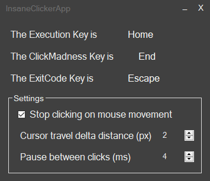

# clicker
A small auto-clicker app for windows that I made around 10 years ago.

## Features

- Press the Command Key + Execution Key (`End` + `Home` by default) to initiate automatic clicks every 4 ticks.\
  Repeat to Abort the clicking.

- Press the Exit Key + Execution Key (`Escape` + `Home` by default) to close the app.

- Set the pause between clicks,
  whether to turn off the clicking on mouse movement and how much the mouse should move before turning the clicker off.
